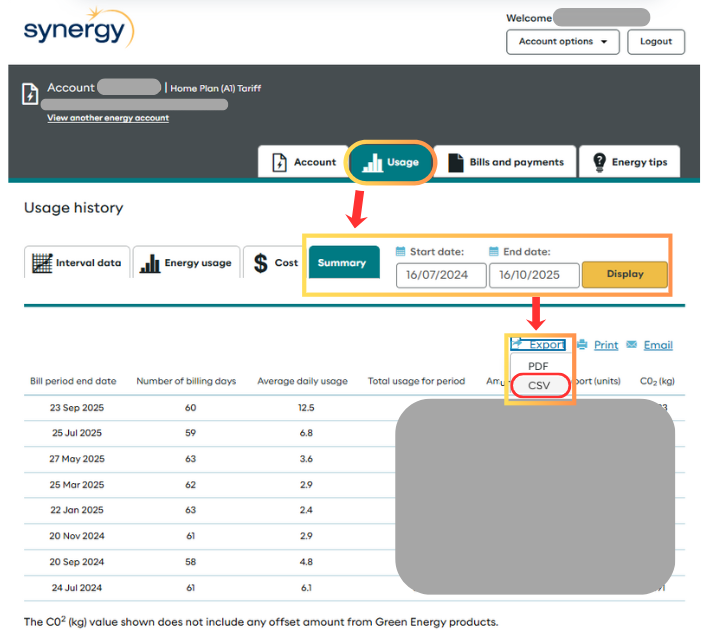

# SolarROI-WA

## About this app

This is your helper to estimate the payback time and return on investment for your rooftop solar panels. 
The input distributed photovoltaics (DPV) generation data are from Western Australia's installed rooftop solar panels connected to SWIS (South West Interconnected System). Data is available from 2020 onwards in [AEMO's public website](https://www.aemo.com.au/energy-systems/electricity/wholesale-electricity-market-wem/data-wem/market-data-wa). In this app, the 2024's full year data is used. 

## Inputs

What you need to provide:
1. CSV of your electricity usage summary, ideally from the recent full year.
   * This can be obtained from your online Synergy account: 
   * If this is not possible, enter the best estimate of your annual electricity usage in kWh.
3. Details of your solar panels:
   * PV size, kW.
   * Capex, $ (user input, or use the built-in estimate based on PV size).
4. Fraction of PV generation for self-consumption.
   * Tip: set self-consumption to reflect appliance timing and household profile. 

## Assumptions

1. The app assumes [Synergy's A1 Home Plan](https://www.synergy.net.au/Your-home/Energy-plans/Home-Plan-A1), which is the majority for WA's households.
2. Peak and off-peak PV export rebate follows the rate of [DEBS](https://www.synergy.net.au/Your-home/Manage-account/Solar-connections-and-upgrades/Distributed-Energy-Buyback-Scheme). 
3. Discount rate is 5%.
4. Average exported PV generation during peak hour is 20% of total PV export (can be adjusted by user).
5. Solar panel performance ratio is 0.85 (can be adjusted by user).
6. Same annual savings throughout the year.
7. PV annual degradation is not included.
8. Electricity tariff increase is not included.

## Outputs
1. :date: Estimated payback time, with a yearly details table available for download.
2. :date: First year's monthly details of PV generation, electricity bill with and without solar, and total savings, also available for download.
3. :bar_chart: Visualization of monthly electricity usage, PV generation, PV self-consumption, and the comparison of electricity bills.
4. :bar_chart: Visualization of savings from PV self-consumption, peak and off-peak export rebate. 
